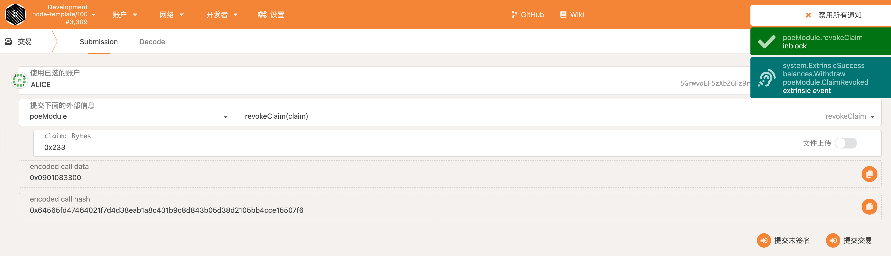
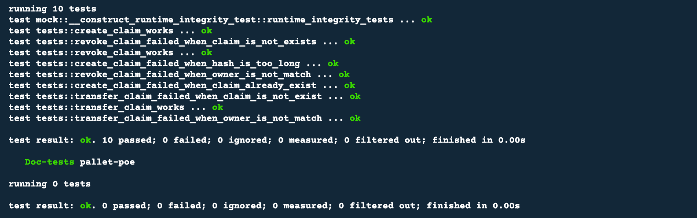

# Substrate 提交记录（时间逆序）

## 第二课 编写 kitties 模块 (pallet-kitties)

### 测试

cargo test --color=always -p pallet-kitties

### 创建

### 转移

### 交易

1. bob 创建并售出

2. alice 买入

   

### 繁殖

## 第一课 编写存证模块 (pallet-poe)

### 创建存证

* 创建前

* 创建后

### 删除存证

## 转移存证

### 单元测试

